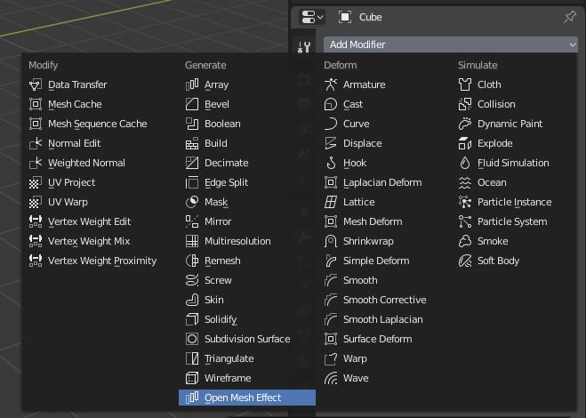

*If this helps you save time or money for your job, please consider supporting the work involved in here ;)* 

OpenMfx for Blender
===================

This is an edited version of Blender 2.93 LTS including an [OpenMfx](https://github.com/eliemichel/OpenMfx) based modifier.

This modifier lets you load an OpenMfx plug-in and use it as a Blender modifier. Such plug-ins can be provided by third party, or even written by yourself following the [OpenMfx](https://github.com/eliemichel/OpenMfx) standard.

## Disclaimer

This is a **work in progress** and by no mean a finished work. Any feedback is welcome, including bug reports, design proposals, code reviews, etc. You can use the [issues](https://github.com/eliemichel/OpenMfxForBlender/issues) to do so. I will post dev updates on my [twitter feed](https://twitter.com/exppad).

## Building

You can just follow the usual [instructions for building Blender](https://wiki.blender.org/wiki/Building_Blender).

## Usage

Create an object and add an *OpenMfx* modifier to it. In the plug-in path, provide the OpenMfx bundle, like `/path/to/something.ofx` (see [openmesheffects.org](https://openmesheffect.org/Implementations/PluginExamples.html) for examples). This will open the binary and list the available plug-ins.

Then select which effect from the plugin you are interested in. With a valid plug-in selected, some parameters will appear.

You can then stack it with other modifiers, and/or apply it.

## License

Blender as a whole, and hence this branch, is licensed under the GNU Public License, Version 3.
Individual files may have a different, but compatible license.

## Misc

### A little guide for syncing with Blender's main branch

Provided the upstream repository is added as `upstream` (if not, run `git remote add upstream git://git.blender.org/blender.git`) and that you are on branch `openmfx`:

    git fetch upstream
    git tag  # find the tag X.X.X you want to merge
    git merge vX.X.X

Then call `make update` to sync the dependencies.

Run a `git status` to see all files marked as `both modified` or `both added`. For files `A`, `B`, `C`, etc. that are not related to OpenMfx nor to the integration of OpenMfx as a modifer, you can run

    git checkout --theirs A B C ...

For unrelated files that are `deleted by them`:

    git rm A B C ...

Other files require manual inspection! Example of files that must be handled manually:

    source/blender/makesdna/DNA_modifier_types.h
	source/blender/makesrna/intern/rna_modifier.c

Look for `>>>>>>>` and treat cases where the conflict area contains mentions to OpenMfx.

Finally, try to build and fix issues.
